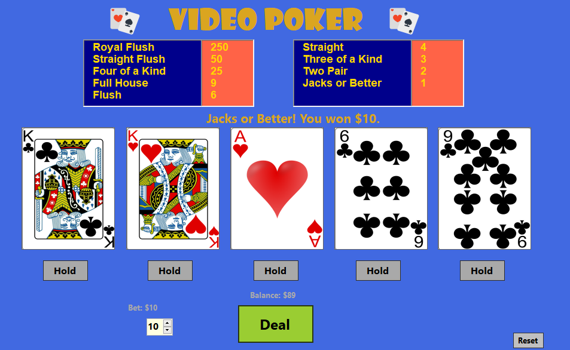

# Video Poker Machine

The Video Poker Machine is a Windows Forms application that simulates a classic video poker game.
Players can bet, deal cards, hold specific cards,and aim to get **Royal Flush**.

## Features

- **Bet and Deal:** Players can place bets and deal a hand of five cards.
- **Hold Cards:** Players can choose to hold specific cards and draw replacements for the others.
- **Hand Evaluation:** Automatically evaluates the player's hand and calculates winnings based on the paytable.
- **Paytable Display:** Displays the payout multipliers for various poker hands.
- **Reset Button:** Resets the player's credits to the default value when they run out.

---

## Screenshot

---

## Installation

1. **Clone the repository:**
	- **https://github.com/bax082024/PokerMachine.git**
2. Open the `.sln` file in **Visual Studio**.
3. **Rebuild Project**
4. Run and enjoy.

---

## Contact 

For questions or feedback, please contact:
	- **bax082024@gmail.com**

---

